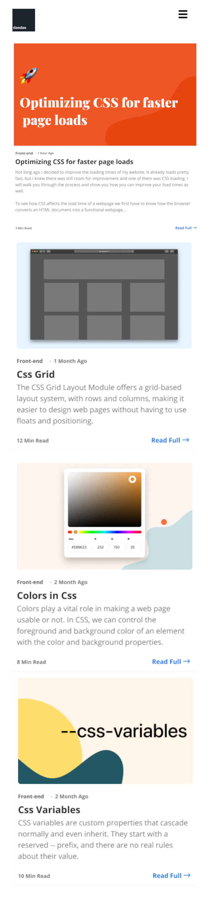
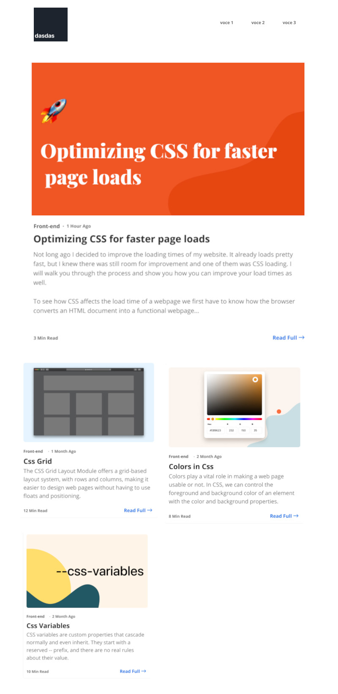
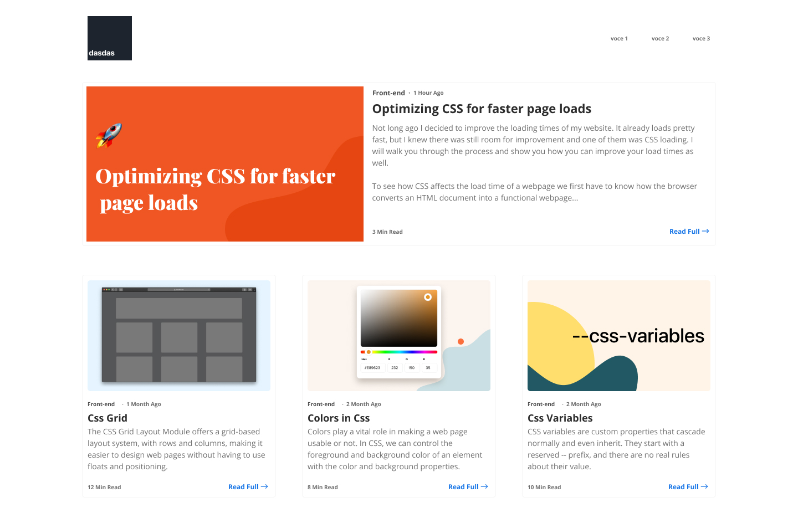

# Primo esercizio di HTML-CSS

Basandoti sulle immagini sottostanti crea la struttura HTML ed il corrispondente foglio di stile per che riproducano la pagina *responsive* sito web illustrato
### template sito web - mobile

### template sito web - medium size

### template sito web - large size

### I testi presenti nell'immagine sono:
## Optimizing CSS for faster page loads
Not long ago I decided to improve the loading times of my website. It already loads pretty fast, but I knew there was still room for improvement and one of them was CSS loading. I will walk you through the process and show you how you can improve your load times as well.

To see how CSS affects the load time of a webpage we first have to know how the browser converts an HTML document into a functional webpage...

## Css Grid
The CSS Grid Layout Module offers a grid-based layout system, with rows and columns, making it easier to design web pages without having to use floats and positioning.

## Colors in Css
Colors play a vital role in making a web page usable or not. In CSS, we can control the foreground and background color of an element with the color and background properties.

## Css Variables
CSS variables are custom properties that cascade normally and even inherit. They start with a reserved -- prefix, and there are no real rules about their value.

## Aprire github.dev sul progetto
Dalla pagina principale di github (code) basta usare il punto "." sulla tastiera per aprire l'ambiente "VS Code" di sviluppo del progetto

## Deployment su github.io
Nella pagina di setting basta usare Github Pages
